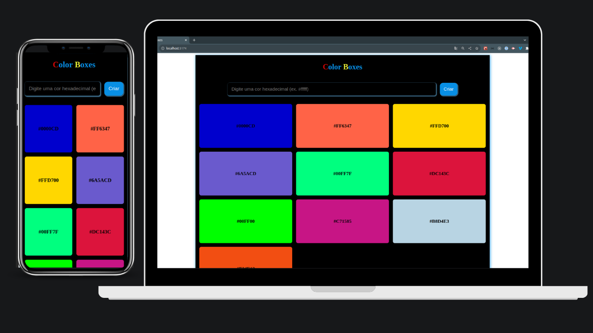

# Box Colors Project

## Projeto desenvolvido para entrega de atividade  do curso full stack iTalents - módulo 1 front end.
  ### Requisitos para entrega:
    * Mínimo 3 componentes
    * Troca de dados via propriedades
    * Atributo children em um dos componentes
    * Estilização de todos os componentes
    * Uso de useState para gerenciamento de estado

## Tecnologia
- React
- TypeScript

